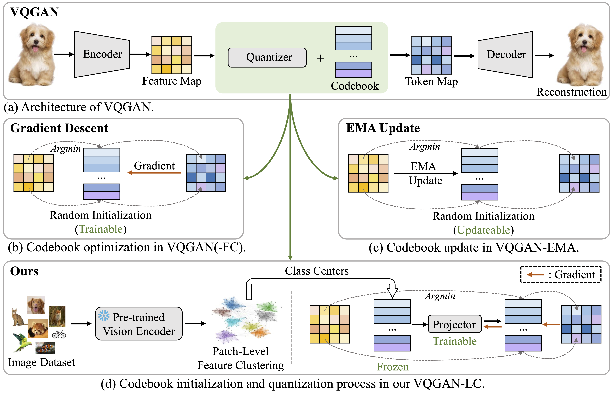

# VQGAN-LC


This is the implementation of the paper ``[Scaling the Codebook Size of VQ-GAN to 100,000 with a Utilization Rate of 99%](https://arxiv.org/pdf/2406.11837)''



## 🔧 Preparation

### Prepare Environment
```bash
pip install -r requirements.txt
```

### Prepare Datasets

Download ImageNet1K dataset and arranged with the following layout:

```
├── /ImageNet1K/
│  ├── /train/
│  ├──  ├── n01440764
│  ├──  ├── n01443537
│  ├──  ├── .........
│  ├── /val/
│  ├──  ├── n01440764
│  ├──  ├── n01440764
│  ├──  ├── .........
```

Download the train/val split of ImageNet1K from our [Google Drive](https://drive.google.com/drive/folders/11mxqPcm8IbbcD6F6DUjufOxcQIXucBcT?usp=sharing).


## 🚗 Runing

### Image Quantization

#### Initialized Codebook Generation

The Initialized codebook should be first downloaded from our [Google Drive](https://drive.google.com/drive/folders/1eTKbOoI8ootxexNgBLs0Dvz-qOdZM21m?usp=sharing) or generate with the following script:
```bash
imagenet_path="IMAGENET PATH"
cd codebook_generation
sh run.sh
```

### Hydra Configuration for Codebook Generation

The codebook generation scripts (`clip_feature_generation.py` and `minibatch_kmeans_per_class.py`) use [Hydra](https://hydra.cc/) for configuration management. This allows for flexible configuration through YAML files and command-line overrides.

**Directory Structure:**

Configuration files are located in `codebook_generation/conf`:
```
codebook_generation/
├── conf/
│   ├── config.yaml                         # Main Hydra config file
│   ├── clip_feature_generation.yaml      # Defaults for clip_feature_generation.py
│   └── minibatch_kmeans_per_class.yaml   # Defaults for minibatch_kmeans_per_class.py
├── clip_feature_generation.py
├── minibatch_kmeans_per_class.py
└── run.sh
```

**Configuration Files:**

*   **`config.yaml`**: This is the main configuration file that Hydra loads. It defines default configurations for the two scripts.
    ```yaml
    defaults:
      - clip_feature_generation: default
      - minibatch_kmeans_per_class: default

    hydra:
      run:
        dir: outputs/${now:%Y-%m-%d}/${now:%H-%M-%S}
    ```
*   **`clip_feature_generation.yaml`**: Contains default parameters for `clip_feature_generation.py`.
    ```yaml
    # @package _group_
    name: "default"
    data_dir: "data/images"                 # Path to the ImageNet dataset (can be overridden by IMAGENET_PATH env var via run.sh or direct override)
    output_dir: "data/clip_features"        # Directory to save CLIP features
    batch_size: 32
    model_name: "ViT-B/32"
    device: "cuda"
    # ... other parameters ...
    ```
*   **`minibatch_kmeans_per_class.yaml`**: Contains default parameters for `minibatch_kmeans_per_class.py`.
    ```yaml
    # @package _group_
    name: "default"
    feature_dir: "data/clip_features"       # Directory where CLIP features are stored
    output_dir: "data/codebooks"            # Directory to save the generated codebooks
    n_clusters: 16
    batch_size: 256
    random_state: 42
    # ... other parameters ...
    ```

**Running with Hydra:**

The `codebook_generation/run.sh` script executes the pipeline using the default configurations defined in the YAML files.
```bash
imagenet_path="IMAGENET_PATH" # Set your ImageNet path
cd codebook_generation
sh run.sh
```
The `imagenet_path` environment variable is used by `run.sh` and is expected to point to your ImageNet dataset. The `data_dir` in `clip_feature_generation.yaml` should correspond to this path.

**Overriding Configuration:**

You can override any configuration parameter directly from the command line.

*   **Override a top-level parameter:**
    ```bash
    python codebook_generation/clip_feature_generation.py batch_size=64
    ```
*   **Override a parameter within a group:**
    ```bash
    python codebook_generation/clip_feature_generation.py clip_feature_generation.batch_size=64 clip_feature_generation.output_dir="new_features_dir"
    python codebook_generation/minibatch_kmeans_per_class.py minibatch_kmeans_per_class.n_clusters=32
    ```
    Note: When calling a script directly, you refer to its configuration group by its name (e.g., `clip_feature_generation.batch_size`).

This system allows you to easily manage different configurations and experiment with parameters without modifying the core scripts. Refer to the Hydra documentation for more advanced features like multirun.

#### VQGAN-LC Training
Training VQGAN-LC with a codebook size 100K with the following script:

```bash
cd vqgan-gpt-lc
imagenet_path="IMAGENET PATH"
codebook_path="INIT CODEBOOK PATH"
torchrun --nproc_per_node 8 training_vqgan.py \
    --batch_size 256 \
    --image_size 256 \
    --epochs 100 \
    --warmup_epochs 5 \
    --lr 5e-4 \
    --n_class 1000 \
    --imagenet_path $imagenet_path \
    --num_workers 16 \
    --vq_config_path vqgan_configs/vq-f16.yaml \
    --output_dir "train_logs_vq/vqgan_lc_100K" \
    --log_dir "train_logs_vq/vqgan_lc_100K" \
    --disc_start 50000 \
    --n_vision_words 100000 \
    --local_embedding_path $codebook_path \
    --tuning_codebook 0 \
    --use_cblinear 1 \
    --embed_dim 8
```

We provide VQGAN-LC-100K trained for 20 epoches at [Google Drive](https://drive.google.com/drive/folders/12824gtaR_upGH1DJRNfAjQFiw8c1FmwJ?usp=sharing).

#### VQGAN-LC Testing
Testing VQGAN-LC for image quantization with the following script:

```bash
cd vqgan-gpt-lc
imagenet_path="IMAGENET PATH"
codebook_path="INIT CODEBOOK PATH"
vq_path="VQGAN-LC PATH"
torchrun --nproc_per_node 1 eval_reconstruction.py \
        --batch_size 8 \
        --image_size 256 \
        --lr 9e-3 \
        --n_class 1000 \
        --imagenet_path $imagenet_path \
        --vq_config_path vqgan_configs/vq-f16.yaml \
        --output_dir "log_eval_recons/vqgan_lc_100K_f16" \
        --log_dir "log_eval_recons/vqgan_lc_100K_f16" \
        --quantizer_type "org" \
        --local_embedding_path $codebook_path \
        --stage_1_ckpt $vq_path \
        --tuning_codebook 0 \
        --embed_dim 8 \
        --n_vision_words 100000 \
        --use_cblinear 1 \
        --dataset "imagenet"
```

PSNR and SSIM are computed by [pyiqa](https://github.com/chaofengc/IQA-PyTorch). rFID is calculated by [cleanfid](https://github.com/GaParmar/clean-fid).


## 📏 Checkpoints

### Image Quantization
| Method  | Resolution | Utilization Rate | rFID Score | Checkpoints |
|---------|---------------|----------|----------|----------|
| VQGAN-LC | f16 | 99.9%     | 2.62 | [Google Drive](https://drive.google.com/drive/folders/12824gtaR_upGH1DJRNfAjQFiw8c1FmwJ?usp=sharing)
| VQGAN-LC | f8 | 99.5%     | 1.29 | [Google Drive](https://drive.google.com/drive/folders/12824gtaR_upGH1DJRNfAjQFiw8c1FmwJ?usp=sharing)

## 👨‍🏫 Acknowledgement
This repo is built on [taming-transformers](https://github.com/CompVis/taming-transformers), [latent-diffusion](https://github.com/CompVis/latent-diffusion), [DiT](https://github.com/facebookresearch/DiT), and [SiT](https://github.com/willisma/SiT).

The evaluation tools are used from [pyiqa](https://github.com/chaofengc/IQA-PyTorch) and [cleanfid](https://github.com/GaParmar/clean-fid).
